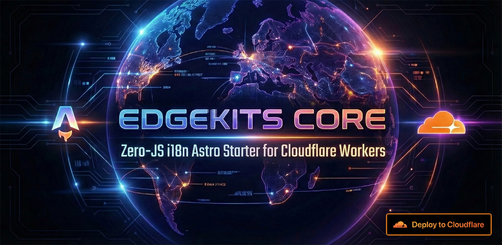

# ⚡ Astro EdgeKits Core: Zero-JS i18n Astro Starter for Cloudflare Workers

<div align="center">
<a href="https://deploy.workers.cloudflare.com/?url=https://github.com/EdgeKits/astro-edgekits-core"></a>
</div>

**Astro + Cloudflare Workers + KV + Type-Safe i18n**

> [!IMPORTANT] **Building a commercial SaaS or Telegram App?**
>
> This repository is the open-source **core engine** (i18n + caching).
> If you need a production-ready foundation with **Authentication**, **Multi-tenancy (Orgs/Teams)**, **D1 Database**, and **Billing (Stripe/Paddle)**, check out the Pro kits.
>
> 🚀 **[Join the EdgeKits Waitlist](https://edgekits.dev)** to get the Early Bird launch discount.

---

# 🏛️ The Philosophy

Astro EdgeKits Core is a minimal, production-ready starter designed for developers building **internationalized** Astro sites on **Cloudflare Workers**. No vendor lock-in. No Vercel tax. 100% Edge-native.

This implementation is a paradigm shift from **"i18n as code"** to **"i18n as data on the Edge"**.

> This literally means that your Worker weighs the same whether your project has 2 languages ​​or 50 languages.

It provides:

- **Zero-JS i18n** (server-side only)
- **Astro middleware–based locale routing**
- **Cloudflare KV–backed translations**
- **Full TypeScript schema auto-generation**
- **Optional fallback dictionaries** (auto-generated)
- **Composable utilities** (cookies, formatting, merging, locale resolution)
- **Clean project structure**

👉 Ideal for building multilingual SaaS marketing sites, docs, landing pages, and platforms deployed on Cloudflare.

> 📖 **Deep Dive:** Want to understand the mechanics and architectural decisions behind this starter? Read our comprehensive guide:
>
> - **[Edge-Native i18n - Part 1: Zero-JS Architecture](https://edgekits.dev/en/blog/edge-native-i18n-astro-cloudflare-part-1/)**
> - **[Edge-Native i18n - Part 2: Localizing Forms on the Edge](https://edgekits.dev/en/blog/edge-native-i18n-astro-cloudflare-part-2/)**
> - **[Edge-Native i18n - Part 3: Granular Edge Cache Purging](https://edgekits.dev/en/blog/granular-edge-cache-purge-astro-cloudflare-part-3/)**

---

# ✨ Features

### ✔ Zero-JS i18n (SSR only)

No client bundles, no hydration - all rendering happens at the edge.

### ✔ Cloudflare KV as translation storage

Translations are stored in KV under keys like:

```
<PROJECT_ID>:<namespace>:<locale>
```

Loaded at request time with caching.

### ✔ Fully typed i18n schema

- Translations are validated and typed based on **DEFAULT_LOCALE**.
- The entire `I18n.Schema` is auto-generated from JSON files.

### ✔ Locale routing via Astro middleware

Supports:

- `/en/...`
- `/de/...`
- `/ja/...` (even if translation files are missing)

### ✔ Optional fallback dictionaries

Generate fallback translations from **DEFAULT_LOCALE**, so the app never breaks even if KV is empty or unavailable.

### ✔ Granular edge cache invalidation via Cloudflare Purge API

Translations are cached per-namespace with a permanent TTL. When you run `i18n:migrate`, only the namespaces whose content actually changed are purged - the rest stay warm in the cache. No Worker redeployment needed.

### ✔ Translations fully decoupled from code deployments

Updating translations never requires a `wrangler deploy`. The `i18n:migrate` command is the only thing needed to push new content to production.

### ✔ Clean DX: simple scripts

```
npm run i18n:bundle   # generate artifacts only (no KV, no deploy)
npm run i18n:seed     # local dev: generate + push to local KV
npm run i18n:migrate  # production: generate + push to remote KV + purge changed cache
```

---

## ⚖️ Core vs. EdgeKits Pro

Astro EdgeKits Core is the best possible _starting point_ for i18n projects. The Pro Starters are fully integrated products designed to save 100+ hours of setup.

| Feature                   | `astro-edgekits-core` | [SaaS Starter](https://edgekits.dev) | [TMA Starter](https://edgekits.dev) |
| :------------------------ | :-------------------: | :----------------------------------: | :---------------------------------: |
| **License**               |      MIT (Free)       |              Commercial              |             Commercial              |
| **i18n Engine (Zero-JS)** |          ✅           |                  ✅                  |                 ✅                  |
| **Edge Caching**          |          ✅           |                  ✅                  |                 ✅                  |
| **Authentication**        |       ❌ (DIY)        |       ✅ (Email/Pass + Social)       |         ✅ (Telegram Auth)          |
| **Database**              |        KV Only        |        ✅ Cloudflare D1 (SQL)        |       ✅ Cloudflare D1 (SQL)        |
| **Multi-tenancy**         |          ❌           |        ✅ (Orgs, Roles, RBAC)        |          ❌ (User-centric)          |
| **Billing**               |          ❌           |          ✅ Stripe & Paddle          |          ✅ Telegram Stars          |

[View all Pro features →](https://edgekits.dev)

---

# 🚀 Quick Start

### 1. Clone the repo

```bash
git clone https://github.com/EdgeKits/astro-edgekits-core.git
cd astro-edgekits-core
```

### 2. Install dependencies

```bash
npm install
```

### 3. Review i18n config

The template comes pre-configured, but you can adjust the supported languages in `src/domain/i18n/constants.ts`. Astro's routing is already set up in `astro.config.ts` to use these constants.

```ts
i18n: {
  locales: [...SUPPORTED_LOCALES], // e.g. ["en", "ja", "de", "es", "pt-br"]
  defaultLocale: DEFAULT_LOCALE,   // "en"
  routing: {
    prefixDefaultLocale: true,
    redirectToDefaultLocale: false,
  },
},
```

**Note:**

Astro EdgeKits Core supports both two-letter ISO 639-1 locales (e.g. `"en"`, `"ja"`, `"de"`) and region-based BCP 47 locales (e.g. `"pt-br"`, `"en-us"`, `"zh-tw"`). Always use **lowercase** for locale codes in `SUPPORTED_LOCALES` and in `./locales/` folder names (e.g. `"pt-br"`, not `"pt-BR"`). Astro uses these values directly in URL paths and content collection lookups - mixed case will cause routing and file resolution errors. The project normalizes locale codes to proper IETF tags (`"pt-BR"`) only where the spec requires it: the HTML `lang` attribute and `hreflang` SEO tags.

The `SUPPORTED_LOCALES` and `DEFAULT_LOCALE` constants are defined in `/src/domain/i18n/constants.ts`.

### 4. Configure Worker KV

```bash
npm run setup
```

> [!TIP] **No Cloudflare account needed for local development.**
> The template ships with a placeholder KV ID in `wrangler.jsonc`:
>
> ```jsonc
> "kv_namespaces": [
>   {
>     "binding": "TRANSLATIONS",
>     "id": "your_kv_id_here"
>   }
> ]
> ```
>
> Wrangler uses this string as a folder name inside `.wrangler/state/v3/kv/` - it never validates the format locally. You can run `npm run i18n:seed` and `npm run dev` immediately without creating a real KV namespace.
>
> A real KV namespace ID is only needed when you are ready to deploy to production with `npm run i18n:migrate`. See **"Creating KV namespaces"** below for instructions.

### 5. Generate types from env vars

Run this command whenever you add or remove environment variables in `.dev.vars` or `wrangler.jsonc`, or modify bindings in `wrangler.jsonc`.

```bash
npm run typegen
```

### 6. Seed translations (local)

```bash
npm run i18n:seed
```

This:

- Builds i18n artifacts
- Creates `i18n-data.json`
- Uploads it to your **local** KV namespace

### 7. Start local dev server

```bash
npm run dev
```

Open:

```txt
http://localhost:4321/en/
http://localhost:4321/de/
http://localhost:4321/es/
http://localhost:4321/ja/
```

or just:

```txt
http://localhost:4321/
```

---

## 📦 How to drop this i18n engine into your existing Astro project

The i18n engine follows a domain-driven project structure - business logic in `src/domain/`, shared utilities in `src/utils/`, build scripts in `scripts/`. This is a deliberate architectural choice that keeps the codebase navigable as a complete project (website, SaaS, etc.), though it means the engine files are distributed across the directory rather than isolated in a single self-contained folder. To integrate into an existing Astro project, copy the relevant directories as described below:

1. **Copy the Domain & Utils:**
   - Copy `src/domain/i18n` into your project's `src/domain` folder.
   - Copy `src/domain/seo` into your project's `src/domain` folder.
   - Copy `src/utils` into your project's `src/utils` folder (the i18n engine relies on these shared helpers like `cookies.ts` and `deep-merge.ts`).
   - Copy `src/middleware` into your project's `src` folder.
2. **Copy the Generator Script:**
   - Copy `scripts/bundle-translations.ts` to your project and add the `i18n:*` commands to your `package.json` scripts.
3. **Copy Locales & Config:**
   - Create a `./locales` folder in the root of your project and add your JSON files.
   - Copy `src/config/project.ts` (or update the i18n constants to point to your existing config).
4. **Update `astro.config.ts`:**
   - Set `trailingSlash: 'ignore'` and `output: 'server'`.
   - Add the `i18n` configuration object (don't forget the imports):

     ```ts
     import { SUPPORTED_LOCALES, DEFAULT_LOCALE } from './src/domain/i18n/constants'

     // ... inside defineConfig:
     i18n: {
       locales: [...SUPPORTED_LOCALES],
       defaultLocale: DEFAULT_LOCALE,
       routing: {
         prefixDefaultLocale: true,
         redirectToDefaultLocale: false,
       },
     },
     ```

5. **Set up Middleware:**
   - Copy `src/middleware/index.ts` (or integrate `i18nMiddleware` into your existing `sequence`).
6. **Update Types:**
   - Update your `src/env.d.ts` to include `uiLocale`, `translationLocale`, and `isMissingContent` in the `App.Locals` interface.
   - Copy `src/i18n.base.d.ts`.
7. **Generate & Run:**
   - Run `npm run i18n:bundle` to generate the schemas.
   - Use `Astro.locals.translationLocale` and `fetchTranslations()` in your pages!

---

## Creating KV namespaces

Astro EdgeKits Core relies on a single KV namespace bound as `TRANSLATIONS`.

### Local development - no setup required

The template ships with a placeholder ID in `wrangler.jsonc`:

```jsonc
"kv_namespaces": [
  {
    "binding": "TRANSLATIONS",
    "id": "your_kv_id_here"
  }
]
```

Wrangler stores local KV data inside `.wrangler/state/v3/kv/<id>/` - the value of `id` is used only as a folder name and is never validated locally. This means you can run `npm run i18n:seed` and `npm run dev` immediately without a Cloudflare account or a real namespace.

> [!NOTE] The `preview_id` field is optional and only needed when using `wrangler dev --remote` to develop against remote Cloudflare resources. For standard local development this starter does not require it.

### Production - create a real KV namespace

When you are ready to deploy, create a KV namespace in Cloudflare and paste its ID into `wrangler.jsonc`:

**Via Wrangler CLI:**

```bash
npx wrangler kv namespace create TRANSLATIONS
```

Copy the printed `id` value into `wrangler.jsonc`:

```jsonc
"kv_namespaces": [
  {
    "binding": "TRANSLATIONS",
    "id": "<YOUR_KV_NAMESPACE_ID>"
  }
]
```

**Via Cloudflare Dashboard:**

1. Open `https://dash.cloudflare.com/<ACCOUNT_ID>/workers/kv/namespaces`.
2. Click **"Create namespace"**, enter a name (e.g. `my-project-translations`), click **Create**.
3. Copy the **Namespace ID** and paste it into `wrangler.jsonc` as above.

---

# 🗂 Project Structure

```text
src/
  assets/                        # Images, SVG icons, logos
  components/
    blog/                        # Blog-specific wrappers and islands
    icons/                       # Shared SVG components (e.g., Flag, SvgIcon)
    islands/                     # React components (hydrated on the client)
    layout/                      # Header, Footer, Hero, MainNav
    ui/                          # shadcn/ui base components
    utils/                       # Utility components (HeroCta, Logos)

  config/                        # App-wide configurations
    cookies.ts                   # Cookie TTL settings
    links.ts                     # External links
    project.ts                   # Project ID and name

  content/
    blog/                        # MDX posts (localized via folder structure)

  domain/                        # 🧠 Core Business Logic (DDD)
    i18n/                        # 🌐 Internationalization Engine
      components/                # LanguageSwitcher, MissingTranslationBanner
      middleware/                # URL routing, soft 404s, locale detection
      constants.ts               # Supported locales, default locale
      fetcher.ts                 # KV fetching, per-namespace edge caching, fallbacks
      format.ts                  # String interpolation, pluralization
      resolve-locale.ts          # uiLocale / translationLocale resolution
      schema.ts                  # Zod schemas & generated types
      translations-keys.ts       # Single source of truth for KV keys and cache URLs
    seo/                         # 🔍 SEO & Crawlers
      components/                # JsonLd, SeoHreflangs, NoIndex
      services/                  # robots, sitemap, rss, llms generation
    theme/                       # 🎨 Theme Management
      components/                # ThemeScript, ThemeToggle

  layouts/
    BaseLayout.astro             # Shared HTML shell: <html lang>, SEO headers, theme

  middleware/
    demoProtectionMiddleware.ts  # SEO protection for staging/demo environments
    index.ts                     # Combines middlewares via sequence()

  pages/
    [lang]/                      # Locale-aware dynamic routes
      index.astro                # Localized landing page
      rss.xml.ts                 # Locale-specific RSS feed
      blog/
        index.astro              # Localized blog index
        [...slug].astro          # Localized blog post reader
    404.astro                    # Fallback 404 page
    index.astro                  # Root (intentionally empty, middleware redirects)
    llms.txt.ts                  # AI context file
    robots.txt.ts                # Dynamic robots.txt
    sitemap.xml.ts               # Dynamic sitemap

  styles/
    global.css                   # Tailwind layers, theme tokens, typography

  utils/
    server/                      # Server-side utilities (cookie wrappers)
    shared/                      # Shared helpers (deep-merge, env boolean parser)

  env.d.ts                       # Extends App.Locals with runtime + locale typings
  i18n.base.d.ts                 # Committed stub for i18n typings
  i18n.generated.d.ts            # Generated from JSON (gitignored)

locales/                         # JSON translations grouped by locale
  en/
    blog.json
    common.json
    ...
  de/ ...
  es/ ...
  ja/ ...

scripts/
  bundle-translations.ts         # Main i18n generator (JSON → KV payload + TS types)
  setup.mjs                      # One-shot setup: copies .dev.vars templates
```

---

# 🛠 Tooling

This starter ships with a minimal but opinionated formatting setup:

- **Prettier** is configured with `singleQuote: true`, so JavaScript/TypeScript strings and most attributes will use single quotes by default.
- Formatting for Astro files is handled by **`prettier-plugin-astro`**, and class sorting is handled by **`prettier-plugin-tailwindcss`**.

If you prefer double quotes or want to adjust the formatting style, you can change it directly in `prettier.config.mjs`:

```js
// prettier.config.mjs
export default {
  plugins: ['prettier-plugin-tailwindcss', 'prettier-plugin-astro'],
  overrides: [{ files: '*.astro', options: { parser: 'astro' } }],
  semi: false,
  singleQuote: true, // set to false if you prefer double quotes
}
```

---

# 🌍 How i18n Works

## 1. Translations live in `./locales/<locale>/<namespace>.json`

Example:

`./locales/en/landing.json`

```json
{
  "welcome": "Welcome back, {name}!",
  "subscription": {
    "status": "Your plan renews on {date}."
  }
}
```

> [!TIP]: Break your JSON into smaller namespaces (buttons.json, hero.json, etc.) instead of dumping everything into common.json.

KV keys are generated as:

```

<PROJECT.id>:<NAMESPACE>:<LOCALE>

```

---

## 2. Locale routing with middleware

Middleware guarantees strict locale-aware routing. Every incoming URL is normalized to a canonical structure:

    /about → /en/about/

(depending on cookie and browser preferences)

The pipeline consists of two layers:

1. **i18nMiddleware**
   - Detects `uiLocale` based on URL, cookies, and browser preferences.
   - Fixes the URL when needed (injecting the locale segment).
   - Writes `ctx.locals.uiLocale`.

2. **localeMiddleware**
   - Normalizes `uiLocale` into `translationLocale`.
   - Writes `ctx.locals.translationLocale`.

Result:

- `Astro.locals.uiLocale` is used for `<html lang>`, SEO, navigation.
- `Astro.locals.translationLocale` is used for KV translation loading.

This removes the need for lang props and eliminates repeated locale-resolution logic across pages.

---

### Request flow

Full request-processing pipeline:

    Incoming HTTP request
              │
              ▼
    ┌─────────────────────────────┐
    │  Middleware (middleware/)   │
    │                             │
    │  1) i18nMiddleware          │
    │     - Detects uiLocale      │
    │       from URL / cookies /  │
    │       browser               │
    │     - Writes ctx.locals.    │
    │       uiLocale              │
    │                             │
    │  2) localeMiddleware        │
    │     - Derives               │
    │       translationLocale     │
    │       from uiLocale         │
    │     - Writes ctx.locals.    │
    │       translationLocale     │
    └──────────────┬──────────────┘
                   │
                   ▼
    ┌─────────────────────────────┐
    │ Layout (BaseLayout.astro)   │
    │                             │
    │ - Reads Astro.locals.       │
    │   uiLocale for <html lang>  │
    │ - Uses it for hreflangs,    │
    │   metadata, SEO, etc.       │
    └──────────────┬──────────────┘
                   │
                   ▼
    ┌─────────────────────────────┐
    │ Pages (index/about/etc.)    │
    │                             │
    │ - Read Astro.locals.        │
    │   translationLocale         │
    │ - Call fetchTranslations(   │
    │   env, translationLocale,   │
    │   [...namespaces])          │
    └──────────────┬──────────────┘
                   │
                   ▼
    ┌─────────────────────────────┐
    │ UI components / islands     │
    │                             │
    │ - Receive typed translation │
    │   dictionaries as props     │
    │ - Render strings without    │
    │   re-fetching or guessing   │
    └─────────────────────────────┘

This design provides:

- No duplication of locale-resolution logic.
- No lang prop-drilling through layouts and pages.
- Unified UI locale + translation locale behavior.
- Stable results regardless of regional variants (`/en`, `/en-US`).

Example inspection:

    UI locale: {Astro.locals.uiLocale}
    Translations locale: {Astro.locals.translationLocale}

---

## 3. Fetching translations

All locale resolution happens in middleware, so pages and components receive ready values:

- `Astro.locals.uiLocale` - the UI locale the user **expects** to see based on their language selection
- `Astro.locals.translationLocale` - locale used for KV fetching

### Understanding `uiLocale` vs `translationLocale`

This starter distinguishes **two different locale concepts**, each with a specific purpose.
This separation is critical for preventing runtime crashes and ensuring a graceful fallback behavior.

---

### `uiLocale` - the user’s chosen language

Represents the locale **intended by the user** and controls the visible interface:

- URL structure (`/en/...`, `/de/...`)
- Browser / cookie language preference
- Navigation & routing
- `<html lang="">`
- SEO signals
- Language switcher selection

`uiLocale` **does not require translation files** to exist.

Example:
If the user visits `/ja/about`, then:

```

uiLocale = "ja"

```

even if `ja/` translations are missing.

---

### `translationLocale` - the safe locale used for KV translation fetch

Represents the locale that **actually has translation data available**.

- Ensures KV fetch always succeeds
- Prevents missing-property crashes
- Guarantees consistent fallback behavior
- May differ from `uiLocale`

If `uiLocale` has no translation files, we fall back to `DEFAULT_LOCALE`.

Example:

```

uiLocale = "ja"
translationLocale = "en" // safe fallback

```

This prevents errors like:

```

Cannot read properties of undefined (reading "welcome")

```

---

### Summary Table

| Concept                         | `uiLocale`             | `translationLocale`     |
| ------------------------------- | ---------------------- | ----------------------- |
| Comes from                      | URL / cookie / browser | Derived from `uiLocale` |
| Must exist in SUPPORTED_LOCALES | Yes                    | Yes                     |
| Must have translation files     | No                     | Yes                     |
| Affects routing                 | Yes                    | No                      |
| Affects KV fetch                | No                     | Yes                     |
| Used in `<html lang="">`        | Yes                    | No                      |

---

### Why this separation matters

By keeping these two concepts separate:

- URLs behave exactly as users expect
- SEO remains correct
- UI language reflects the user’s intent
- Translation fetches never break due to missing JSON
- Fallback dictionaries (if enabled) work reliably

This pattern is one of the key design features of **Astro EdgeKits Core** and ensures a stable multilingual experience with zero client-side JavaScript.

### How translation loading works

`fetchTranslations` accepts:

1. Worker `env`
2. `translationLocale`
3. A list of namespaces

Usage example:

```astro
---
import { fetchTranslations } from '@/domain/i18n/fetcher'

const { translationLocale, runtime } = Astro.locals

const { common, landing } = await fetchTranslations(
  runtime,
  translationLocale,
  ['common', 'landing'],
)
---
```

The function provides:

- Full static typing from `I18n.Schema`
- Automatic merge with fallback dictionaries
- Safe behavior when KV returns `{}` or is unreachable
- Loading only the namespaces required by the current page
- Consistent behavior for regional URLs (`/en-US/` → `"en"`)

Together, these guarantees ensure consistent and predictable translation behavior across your entire application.

---

## 💡 Note on URL Strategy

You might notice that we recommend keeping Markdown filenames (slugs) in English across all locales (e.g., `architecture.md` for both `/en/` and `/de/`).
This is an intentional decision based on several practical considerations.

### Why this approach?

1. **Shareability & UX**
   Non-Latin slugs (Cyrillic, Kanji, Arabic, etc.) become percent-encoded in URLs.
   A clean path like `/ja/blog/architecture` is far easier to share than:

   ```
   /ja/%E3%82%A2%E3%83%BC%E3%82­AD...
   ```

2. **Cross-platform stability**
   Unicode filenames often create git conflicts due to filesystem normalization differences
   between macOS and Windows. ASCII filenames ensure consistent behavior across all machines.

3. **Predictable content loading**
   This starter fetches Markdown entries by canonical `id` using Astro Content Collections.
   Keeping filenames identical across locales avoids lookup tables, reverse mappings, and
   reduces complexity in `[...slug].astro`.

### What if you need localized URLs?

If your project requires localized paths (e.g., `/de/architektur`), you can implement a
lightweight slug-mapping layer:

```
localizedSlug → canonicalSlug → getEntry()
```

This preserves stable filenames while exposing SEO-friendly localized URLs.
A more complete mapping utility may be added as an optional extension in future versions.

---

## 🔍 SEO Considerations for Multilingual Sites

Localized slugs _can_ improve CTR and readability in region-specific search results, but they
come with trade-offs. When deciding whether to localize URLs, consider:

### ✔ When localized slugs help

- Region-specific websites targeting a single country
- Content with highly competitive localized keywords
- Sites where user trust strongly depends on native language presentation

### ✔ When English slugs are the better option

- Global, multi-market documentation or developer-focused sites
- Projects with mixed-script languages (e.g., Cyrillic, Kanji, Arabic), where percent-encoding
  degrades link appearance
- Repositories where cross-platform git compatibility and file stability matter
- Multilingual setups where maintaining slug mappings would add unnecessary overhead

### ✔ Technical recommendation

For most international developer-oriented websites (including this demo),
**English canonical slugs provide the highest stability with minimal SEO downside**.
Google ranks pages based on content, hreflangs, and canonical metadata—slug localization
provides a _small_ benefit compared to these factors.

If full localization is desired, the recommended pattern is:

- keep filenames in English,
- map localized URL aliases → canonical IDs,
- add canonical + hreflang tags to avoid duplicate-content collisions.

This offers the best of both worlds: SEO-friendly displayed URLs, with a stable internal architecture.

---

# 🔍 Edge-Native SEO Tools

Astro EdgeKits Core comes with a fully automated, dynamic SEO suite located in `src/domain/seo/services/`. All endpoints are Edge-cached in production to save Worker CPU cycles.

### 1. Dynamic `robots.txt` (`src/pages/robots.txt.ts`)

Generates your robots policy dynamically.

- If `DEMO_MODE="on"` is set in your environment (e.g., for staging or preview deployments), it completely blocks crawlers (`Disallow: /`) to prevent SEO cannibalization of your main site.
- In production, it opens crawling and points to your `sitemap.xml`.

### 2. Global Sitemap (`src/pages/sitemap.xml.ts`)

Automatically generates a valid XML sitemap containing:

- Static routes across all supported locales.
- Dynamic Content Collection routes (like blog posts) mapped correctly to their localized URLs.

### 3. Locale-Specific RSS Feeds (`src/pages/[lang]/rss.xml.ts`)

Generates dedicated RSS feeds for each language. If a user subscribes to `https://yoursite.com/es/rss.xml`, they will only receive articles published in Spanish. The feeds include properly localized metadata.

### 4. AI Agents Context (`src/pages/llms.txt.ts`)

Implements the `llms.txt` standard to provide a clean, context-rich overview of your site for AI agents (like ChatGPT, Perplexity, or Claude).
To save LLM context window tokens, this endpoint intelligently filters out localized noise and serves your latest content _only_ in the `DEFAULT_LOCALE`.

---

# ⚡ Edge Caching for Translations (Cloudflare Cache API)

Astro EdgeKits Core includes **built-in edge caching** for all translation fetches.

`fetchTranslations` uses the Cloudflare **Cache API** via:

```ts
Astro.locals.runtime.caches.default
```

This provides:

- Zero KV reads on the hot path - translations are served directly from the nearest POP
- Fewer KV reads (reduced cost and more predictable billing)
- Stable behavior under load and temporary KV degradation

---

## Cache key structure

Each namespace is cached **individually** under a static, non-versioned URL:

```txt
https://<PROJECT.id>/<encodeURIComponent(<PROJECT.id>:i18n:<locale>:<namespace>)>
```

Example:

```txt
https://edgekits.dev/edgekits.dev%3Ai18n%3Aen%3Acommon
https://edgekits.dev/edgekits.dev%3Ai18n%3Aen%3Alanding
```

Where `PROJECT.id` comes from `src/config/project.ts`.

The formula is defined once in `src/domain/i18n/translations-keys.ts` and shared between `fetcher.ts` (runtime cache reads/writes) and `bundle-translations.ts` (Purge API calls) - no duplication, no drift.

---

## How the cache works

`fetchTranslations(runtime, locale, ['ns1', 'ns2', ...])` performs:

1. **Parallel cache lookup** - checks each namespace individually and simultaneously:

   ```ts
   const cacheResults = await Promise.all(
     namespaces.map(async (ns) => {
       const cached = await cache.match(
         buildTranslationCacheRequest(locale, ns),
       )
       return { ns, data: await cached?.json(), hit: !!cached }
     }),
   )
   ```

2. **Filter misses** - collect only the namespaces not found in cache.

3. **Single KV batch** - fetch all missing namespaces in one `getAll()` call:

   ```ts
   const kvResults = await env.TRANSLATIONS.get(missingKvKeys, { type: 'json' })
   ```

4. **Merge with fallbacks** - apply `FALLBACK_*` compiled dictionaries if present.

5. **Write to cache** - store each resolved namespace individually with a permanent TTL:

   ```ts
   const response = new Response(JSON.stringify(nsData), {
     headers: {
       'Content-Type': 'application/json; charset=utf-8',
       'Cache-Control': 'public, s-maxage=31536000, immutable',
     },
   })
   await cache.put(buildTranslationCacheRequest(locale, ns), response)
   ```

The cached payload per entry contains the merged translation JSON for one `locale:namespace` pair, with fallback dictionaries already applied.

---

## Hot path - zero KV reads

Once all namespaces for a given locale are cached on an edge node:

```
cache.match(en:common)  → HIT ┐
cache.match(en:landing) → HIT ┤ → return immediately, zero KV reads
cache.match(en:blog)    → HIT ┘
```

This state persists **indefinitely** until the Cloudflare Purge API explicitly invalidates a specific entry.

---

## Cache invalidation via Cloudflare Purge API

Cache entries use `s-maxage=31536000, immutable` - they never expire on their own. Invalidation is handled **explicitly and granularly** by `bundle-translations.ts` when you run `npm run i18n:migrate`:

1. For each `locale:namespace` pair, compute a content hash from the JSON.
2. Compare against hashes stored in `.i18n-hashes.json` from the previous run.
3. Build Purge API URLs **only for changed namespaces**.
4. Call the Cloudflare Cache Purge API - only those entries are invalidated.
5. Update `.i18n-hashes.json`.

Example: you fix a typo in `en/landing.json`. Only `en:landing` is purged. All other locales and namespaces remain warm in the cache - no unnecessary KV reads triggered.

> [!IMPORTANT] Cache Purge API requires a proxied domain (orange cloud in Cloudflare DNS). It does **not** work on `*.workers.dev` subdomains. See **Production Setup** below.

---

## Cache lifetime

```http
Cache-Control: public, s-maxage=31536000, immutable
```

- Cache entries never expire on their own.
- Invalidation is always explicit via `npm run i18n:migrate`.
- If the Purge API call fails (e.g. missing token), KV is still updated correctly - the cache will serve stale translations until the next successful `i18n:migrate`. This is non-fatal.

---

## Environment flags: I18N_CACHE, DEBUG_I18N, and DEMO_MODE

Core behavior is controlled by Wrangler variables:

```ts
function isCacheEnabled(env: Env): boolean {
  return parseBooleanFlag(env.I18N_CACHE, /* defaultValue */ true)
}

function debug(env: Env, ...args: unknown[]) {
  const enabled = parseBooleanFlag(env.DEBUG_I18N, /* defaultValue */ false)
  if (!enabled) return
  console.log(...args)
}
```

`parseBooleanFlag` accepts:

- `"1"`, `"true"`, `"on"` → `true`
- `"0"`, `"false"`, `"off"` → `false`
- `undefined` → `defaultValue`

### I18N_CACHE

```jsonc
"vars": {
  "I18N_CACHE": "on"
}
```

- Controls whether the edge cache is used at all.
- If disabled, `fetchTranslations` skips `cache.match` and `cache.put` and always reads directly from KV.

Recommended:

- **dev**: `"off"` in `.dev.vars` while actively editing translations - translations reload on every request.
- **preview/prod**: `"on"`.

### DEBUG_I18N

```jsonc
"vars": {
  "DEBUG_I18N": "off"
}
```

- Enables verbose logging: cache hits/misses, KV batch results, error fallbacks.

Recommended:

- **dev / preview**: `"on"` when debugging.
- **prod**: `"off"`.

### CLOUDFLARE_ZONE_ID

```jsonc
"vars": {
  "CLOUDFLARE_ZONE_ID": "your_cf_zone_id_here"
}
```

- Zone ID of your Cloudflare-proxied domain. Used by `bundle-translations.ts` to call the Purge API.
- **Not a secret** - safe to commit to public repositories.
- Find it in the Cloudflare Dashboard → your domain → Overview → right sidebar.

### DEMO_MODE (SEO Protection)

```jsonc
"vars": {
  "DEMO_MODE": "off"
}
```

- When set to `"on"`, injects `X-Robots-Tag: noindex, nofollow` and sets `robots.txt` to `Disallow: /`.
- Prevents staging/preview environments from being indexed by search engines.

Recommended:

- **dev / preview / staging**: `"on"`.
- **prod**: `"off"`.

After adding or modifying vars in `wrangler.jsonc` or `.dev.vars`, run:

```bash
npm run typegen
```

---

## Behavior by environment

### `npm run dev` (Astro dev)

- Runs Astro's Node-based dev server.
- `Astro.locals.runtime.caches.default` is effectively a stub - cache writes do not persist across requests.
- Result: **edge caching is effectively disabled** in this mode.
- KV + fallbacks still work correctly; only caching differs.
- Set `I18N_CACHE=off` in `.dev.vars` to make this explicit.

Use this mode for **fast UI iteration**, not for testing cache behavior.

### `npm run preview` (Astro + Wrangler dev / Miniflare)

Typically:

```bash
astro build && wrangler dev
```

- Runs your built Worker in a Miniflare-based environment.
- `runtime.caches.default` and `ctx.waitUntil` behave like real Cloudflare Workers.
- `fetchTranslations` fully exercises the Cache API.
- You will see real **cache HIT / MISS** patterns in logs when `DEBUG_I18N=on`.

Use this mode to validate edge-caching behavior end-to-end.

### Production (`wrangler deploy`)

- Globally distributed across Cloudflare POPs.
- Each POP maintains its own per-namespace cache entries.
- Invalidation is triggered by `npm run i18n:migrate` via Purge API - no redeployment needed.

---

## Failure modes and fallbacks

If KV is temporarily unavailable or returns `{}`:

- `fetchTranslations` merges KV result with any available `FALLBACK_*` constants generated from `DEFAULT_LOCALE`.
- If KV completely fails, i18n falls back to **fallback-only** mode - typed empty-safe objects are returned, no crashes.

Even during KV outages, existing cached entries (if present) and fallback dictionaries keep translations functional.

---

> **Note: Cloudflare KV Limits (Free & Paid Plans)**
>
> Translation loading relies on Cloudflare KV.
> For detailed information about KV storage, reads, writes, and free-tier/paid quotas, see:
> https://developers.cloudflare.com/kv/platform/
>
> Per-namespace caching significantly reduces KV-read volume. On the hot path, KV is never read - only on the first request per namespace per edge node, or after a cache purge triggered by `i18n:migrate`.

---

## 📢 Optional: Missing Translation Banner (Dual-Mode)

In multilingual projects, users may select a locale for which translations or specific articles are not yet fully available.
With **Astro EdgeKits Core**, such locales are still fully routable (`/ja/about`), but the system silently falls back to `DEFAULT_LOCALE` for any missing translation data to prevent crashes.

To improve UX, we provide an optional banner informing users about the language fallback. The banner operates in **Dual-Mode**:

1. **UI Missing (`ui`):** The user selected a language that is missing some (or all) JSON translation namespaces in `./locales/`. Any untranslated parts of the UI will gracefully fall back to the default language (English), while the available translations are still displayed (e.g., the page text is in Spanish, but some new buttons remain in English).
2. **Content Missing (`content`):** The UI is translated, but the specific Markdown/MDX Content Collection entry (e.g., a blog post) does not exist in the requested language. Only the article falls back to English.

### Enabling or Disabling the banner

You can control this feature via a single flag in `src/domain/i18n/constants.ts`:

```ts
export const ENABLE_MISSING_TRANSLATION_BANNER = true
```

### How the banner text is translated

Unlike hardcoded solutions, the banner itself is fully integrated into the i18n system. The text is fetched from the `messages.json` namespace.

If a user requests an unsupported language, the banner will be displayed in `DEFAULT_LOCALE` (English). If the user requests a supported language but the _blog post_ is missing, the banner will be displayed in the user's selected language (e.g., Spanish), apologizing that the content is only available in English.

### Using the banner

Simply drop the `<MissingTranslationBanner />` component into your main layout (`ContentWrapper.astro` or `BaseLayout.astro`):

```astro
---
import MissingTranslationBanner from '@/domain/i18n/components/MissingTranslationBanner.astro'
---

<main>
  <MissingTranslationBanner />
  <slot />
</main>
```

To trigger the `content` mode inside a specific page (like `[...slug].astro`), just set the flag in the Astro context before rendering:

```ts
// src/pages/[lang]/blog/[...slug].astro
let post = await getEntry('blog', `${uiLocale}/${slug}`)

if (!post) {
  post = await getEntry('blog', `${DEFAULT_LOCALE}/${slug}`)
  Astro.locals.isMissingContent = true // Triggers the banner!
}
```

---

# 🧰 Scripts

### 1) Generate artifacts only

```bash
npm run i18n:bundle
```

Generates the following files locally without touching KV or the network:

- `i18n-data.json` - KV bulk payload
- `src/i18n.generated.d.ts` - TypeScript schema
- `src/domain/i18n/runtime-constants.ts` - locale constants

Use this in CI pipelines for type checking before a code deploy.

### 2) Seed local KV (local dev)

```bash
npm run i18n:seed
```

Generates all artifacts **and** pushes translations to your local Miniflare KV store. Run this after cloning the repo or after editing any JSON file in `./locales/` while `I18N_CACHE=off`.

### 3) Push to production KV + purge changed cache

```bash
npm run i18n:migrate
```

Generates all artifacts, pushes to **remote** Cloudflare KV, and calls the Cloudflare Purge API for only the namespaces whose content actually changed. No Worker redeployment needed.

Requires:

- A deployed Worker (run `npm run deploy` at least once first)
- `CLOUDFLARE_ZONE_ID` set in `wrangler.jsonc` vars
- `CLOUDFLARE_CACHEPURGE_API_TOKEN` set in `.dev.vars`

---

## 🔄 Optional: Generate Fallback Dictionaries

Fallback dictionaries are compiled from `DEFAULT_LOCALE` JSON files into a static TypeScript file. When KV is unavailable, `fetchTranslations` automatically uses these compiled constants as a last-resort fallback - keeping the site functional even during KV outages.

Fallback generation is controlled by the `--fallbacks` flag. Pass it to any of the three standard commands:

```bash
npm run i18n:bundle -- --fallbacks   # generate artifacts with fallbacks, no KV
npm run i18n:seed -- --fallbacks     # local dev: generate + seed local KV + fallbacks
npm run i18n:migrate -- --fallbacks  # production: generate + remote KV + purge + fallbacks
```

Or enable it permanently via environment variable (e.g. in `.dev.vars`):

```bash
I18N_GENERATE_FALLBACKS=true
```

This produces:

```
src/domain/i18n/fallbacks.generated.ts
```

With:

```ts
export const FALLBACK_LANDING = {
  welcome: 'Welcome back, {name}!',
  subscription: { status: 'Your plan renews on {date}.' },
}
```

Fallbacks are merged into runtime KV responses automatically:

```ts
const { landing } = await fetchTranslations(...)
landing.welcome // always defined
```

## If KV fails entirely, fallbacks guarantee stable UI.

# 🧩 Format & Interpolation

### Translations (generic JSON structure)

Instead of hard-coding HTML in components, keep simple, generic patterns in JSON and inject variables via `{placeholders}`.

`./locales/en/common.json`

```json
{
  "ui": {
    "emphasis": "Please note: <strong>{content}</strong>",
    "codeSnippet": "Run this command: <code>{code}</code>",
    "learnMore": "Read our <a href='{url}'>{label}</a> for details."
  }
}
```

Use `fmt()` for safe interpolation:

```ts
import { fmt } from '@/domain/i18n/format'

fmt(landing.welcome, { name: userName })
fmt(landing.subscription.status, { date: expiryDate })
fmt(common.ui.emphasis, { content: 'wrangler.jsonc' })
```

Key properties:

- Escapes injected values (XSS-safe).
- Leaves unknown placeholders untouched (`{missing}` stays as is).
- Works the same in normal and fallback-only modes.
- Placeholder names are arbitrary as long as JSON keys match the `values` object (`{name}`, `{quantity}`, `{userId}`, etc.).

---

### Astro usage

```astro
---
import { fmt } from '@/domain/i18n/format'
// ... fetch `common` translations ...

const msg1 = fmt(common.ui.emphasis, { content: 'wrangler.jsonc' })
const msg2 = fmt(common.ui.codeSnippet, { code: 'npm run dev' })
---

<p class="font-semibold" set:html={msg1} />

<div class="bg-blue-500 p-2" set:html={msg2} />
```

Astro renders the HTML from the JSON pattern, while `fmt()` keeps all injected values escaped.

---

### React usage

```tsx
// src/components/Alert.tsx
// type I18n goes from i18n.generated.d.ts
import { fmt } from '@/domain/i18n/format'

export function Alert({
  t,
  errorMsg,
}: {
  t: I18n['common']
  errorMsg: string
}) {
  // If errorMsg contains HTML, fmt() escapes it via escapeHtml().
  const html = fmt(t.ui.emphasis, { content: errorMsg })

  return (
    <div className="alert-box">
      <span dangerouslySetInnerHTML={{ __html: html }} />
    </div>
  )
}
```

Pattern:

1. Keep HTML structure in JSON (`<strong>`, `<code>`, `<a>`).
2. Inject only data values via `fmt()`.
3. Render with `set:html` (Astro) or `dangerouslySetInnerHTML` (React).

This allows you to change markup (for example, replace `<strong>` with `<span class="text-blue-500">`) in translation files without touching component code.

---

### Plural formatting

For simple English-style plurals you can use the lightweight helper:

```ts
import { plural } from '@/domain/i18n/format'

plural(1, '1 item', '{count} items') // "1 item"
plural(3, '1 item', '{count} items') // "3 items"
```

For proper ICU-style plural rules per locale, use `pluralIcu()` and keep patterns in JSON:

`./locales/en/blog.json`

```json
{
  "counter": {
    "patterns": {
      "zero": "No items",
      "one": "{count} item",
      "other": "{count} items"
    }
  }
}
```

`./locales/de/blog.json`

```json
{
  "counter": {
    "patterns": {
      "zero": "Keine Elemente",
      "one": "{count} Element",
      "other": "{count} Elemente"
    }
  }
}
```

Usage:

```ts
import { pluralIcu } from '@/domain/i18n/format'
import type { PluralPatterns } from '@/domain/i18n/format'

function formatCount(count: number, locale: string, patterns: PluralPatterns) {
  return pluralIcu(count, locale, patterns)
}
```

Example inside a React Island:

```tsx
const label = pluralIcu(count, translationLocale, labels.patterns)
```

Behavior:

- Uses `Intl.PluralRules(locale)` under the hood.
- Selects among `zero | one | two | few | many | other`.
- Falls back to `other` if a specific category is missing.
- Still goes through `fmt()`, so `{count}` and other placeholders are escaped safely.

This makes it possible to express real plural logic per language in JSON, while keeping components free of plural rules and string concatenation.

---

# 🍪 Locale Cookie

Set language:

```ts
setCookieLang(context.cookies, locale)
```

Read language:

```ts
const lang = getCookieLang(context.cookies)
```

Automatically used by middleware.

---

# 🧱 Generated Files (should not be edited)

These files are automatically generated and should not be modified manually:

```
src/i18n.generated.d.ts
src/domain/i18n/runtime-constants.ts
src/domain/i18n/fallbacks.generated.ts   # only when using --fallbacks
i18n-data.json
.i18n-hashes.json                        # per-namespace content hashes for incremental Purge API
```

---

# 🔒 Gitignore Requirements

Ensure your `.gitignore` includes:

```
i18n-data.json
src/i18n.generated.d.ts
.i18n-hashes.json
```

`.i18n-hashes.json` stores per-namespace content hashes used to detect which namespaces changed between `i18n:migrate` runs. It is machine-local state - its absence means "first run, purge everything", which is the correct safe default.

Do **NOT** gitignore:

```
src/domain/i18n/fallbacks.generated.ts
src/domain/i18n/runtime-constants.ts
```

These stubs must exist for TypeScript to resolve imports at build time.

---

# 🔑 Production Setup

Before running `npm run i18n:migrate` for the first time, complete these one-time steps in order:

### 1. Create a real KV namespace

Follow the instructions in **"Creating KV namespaces"** above. Paste the real namespace ID into `wrangler.jsonc` under the `TRANSLATIONS` binding.

### 2. Add `CLOUDFLARE_ZONE_ID` to `wrangler.jsonc`

```jsonc
"vars": {
  "CLOUDFLARE_ZONE_ID": "your_cf_zone_id_here"
}
```

Find your Zone ID in Cloudflare Dashboard → your domain → Overview → right sidebar. This value is not a secret and is safe to commit to your repository.

### 3. Create a Cache Purge API token

1. Go to [Cloudflare API Tokens](https://dash.cloudflare.com/profile/api-tokens).
2. Click **"Create Token"**. Either use the **"Cache Purge"** template, or configure manually with the following permissions: `Zone` → `Cache Purge` → `Purge`.
3. Scope it to your zone.
4. Add the token to `.dev.vars` (this file is gitignored - never commit it):

```bash
CLOUDFLARE_CACHEPURGE_API_TOKEN=your_token_here
```

### 4. Deploy the Worker

```bash
npm run deploy
```

The Worker must exist in Cloudflare before `i18n:migrate` can update its KV namespace or purge its cache.

### 5. Add the token as a Worker Secret

After deploying, register the token as a Worker Secret so it is available in the production runtime environment:

```bash
npx wrangler secret put CLOUDFLARE_CACHEPURGE_API_TOKEN
```

Or via the Cloudflare Dashboard: **Worker → Settings → Variables and Secrets → Add**.

### 6. Run your first migration

```bash
npm run i18n:migrate
```

This pushes all translations to remote KV and purges the edge cache for all namespaces (first run - no previous hashes exist, so everything is treated as changed).

> [!IMPORTANT] **Proxied domain required for cache purging.**
> The Cloudflare Purge API only works for domains with the orange cloud (Proxied) enabled in DNS settings. It does **not** work on `*.workers.dev` subdomains. If your domain is not yet proxied through Cloudflare, KV will still be updated correctly - only the cache purge step will be skipped with a warning.

---

# ❓FAQ

### “Do I need to run the i18n generator before `npm run dev`?”

Yes. Run:

```bash
npm run i18n:seed
```

This generates all artifacts **and** seeds your local KV store in one command. It is the recommended command for local development.

`npm run i18n:bundle` alone is sufficient only in CI pipelines (e.g. for type checking before a code deploy) where you have `I18N_CACHE=off` and do not need local KV data.

---

### “Can I add a locale without translations?”

Yes - all locales in `SUPPORTED_LOCALES` are routable.

If translations are missing:

- UI locale still works
- Translation locale falls back to `DEFAULT_LOCALE`
- KV returns `{}`, which merges with fallbacks if enabled

---

### “What happens if KV is offline?”

If fallback dictionaries are enabled:

- Fallback translations are used automatically
- The app continues working without errors

If fallback dictionaries are not enabled:

- KV fetch returns `{}` safely
- You can manually use optional chaining + fallback strings

---

### “Can I add new translation namespaces?”

Yes - simply create a new JSON file:

```
./locales/en/pricing.json
```

Run:

```bash
npm run i18n:bundle
```

The namespace will be automatically discovered.

---

# 🧭 Roadmap

Considering the feasibility of packaging the edge-native i18n engine into a portable module - making it easier to adopt in existing Astro projects without having to start from this template. If that's something you'd find useful, feel free to open an issue or start a discussion.

---

# 🎉 You're ready!

This starter is designed to be a **drop-in foundation** for multilingual Astro apps running on Cloudflare Workers.

If you need additional utilities, deeper integrations (Auth, Agents, AI Gateway, Workflows and more) in production deployment templates - EdgeKits provides extensions that build on this core (coming soon).

Happy shipping!
⚡ **Astro EdgeKits Core**
